# NullProtocol
Automated Reconnaissance & Vulnerability Assessment Pipeline

## Abstract
NullProtocol is an integrated reconnaissance and vulnerability assessment pipeline designed to streamline the information-gathering phase of penetration testing. By orchestrating industry-standard security tools through a Python-based core, it automates the discovery of attack surfaces, from subdomain enumeration to exploit mapping.

The system reduces manual reconnaissance overhead by 70% while providing comprehensive, structured reporting in both human-readable and machine-parsable formats. Perfect for red teams, penetration testers, and security researchers looking to accelerate their initial assessment phases.

## Table of Contents
1.  [Features](#features)
2.  [System Architecture](#system-architecture)
3.  [Project Structure](#project-structure)
4.  [Tech Stack](#tech-stack)
5.  [Module Documentation](#module-documentation)
6.  [Installation](#installation)
7.  [Usage](#usage)
8.  [Output & Reporting](#output--reporting)
9.  [Contributing](#contributing)
10. [Legal Disclaimer](#legal-disclaimer)

## Features

### Intelligent Reconnaissance
*   **Subdomain Discovery**: Automated extraction using sublist3r, crt.sh, and findomain with smart deduplication.
*   **Multi-threaded DNS Resolution**: Concurrent IP resolution using native sockets and custom resolvers.
*   **High-Speed Port Scanning**: Masscan for rapid discovery paired with targeted Nmap for service fingerprinting.

### Web Application Analysis
*   **Technology Stack Detection**: WhatWeb integration for comprehensive tech fingerprinting.
*   **Directory/File Enumeration**: Multi-wordlist directory brute-forcing with Gobuster.
*   **API Endpoint Discovery**: Common API path enumeration and testing.
*   **Quick Vulnerability Checks**: Automatic detection of common misconfigurations (Git exposure, .env leaks, backup files).

### Exploit Intelligence
*   **Automated Exploit Mapping**: Correlation of discovered services with Exploit-DB and Metasploit.
*   **Version-Specific Matching**: Intelligent service version parsing for precise exploit suggestions.
*   **CVE Prioritization**: Ranking of discovered vulnerabilities by potential impact.
*   **Metasploit Integration**: Auto-generation of resource scripts (.rc) for verified vulnerabilities.

### Reporting & Analytics
*   **Unified Reporting**: Single consolidated report with executive summary and technical details.
*   **Geolocation Intelligence**: IP geolocation, ASN information, and threat intelligence correlation.
*   **Multiple Formats**: JSON for automation + Markdown/PDF for human review.
*   **Risk Scoring**: Automated risk assessment based on discovered vulnerabilities.

## System Architecture

### Main Pipeline Flow


### Web Target Pipeline


### Full Flow Simplified

```mermaid
graph TD
    %% START
    A[🎯 Input] --> B{Type?}
    B -->|Domain| C[Domain Pipeline]
    B -->|IP| E[Direct IP]
    
    %% DOMAIN PROCESSING
    subgraph C [Domain]
        C1[Subdomain Discovery]
        C2[DNS Resolution]
        C3[Merge IPs]
    end
    
    C1 --> C2 --> C3 --> D
    
    E --> D[IP List]
    
    %% PORT SCANNING
    D --> F[Port Scanning]
    
    subgraph F [Scanning]
        F1[Masscan: Fast Ports]
        F2[Nmap: Services]
        F3[Nmap: OS Fingerprint]
    end
    
    F1 --> F2 --> F3 --> G
    
    %% ENHANCED RECON
    G[Scan Results] --> H[Recon Enhancer]
    
    subgraph H [Enhanced Analysis]
        H1[Web Analysis]
        H2[Exploit Mapping]
        H3[Threat Intel]
        H4[Report Generation]
    end
    
    H1 --> H4
    H2 --> H4
    H3 --> H4
    
    %% OUTPUT
    H4 --> I[📊 Final Report]
    H4 --> J[📋 Executive Summary]
    
    I --> K[✅ All Findings]
    J --> L[🎯 Critical Issues]
    
    %% STYLING
    style A fill:#4CAF50,color:white
    style B fill:#ff6b6b,color:white
    style C fill:#e3f2fd
    style F fill:#fff3e0
    style H fill:#fce4ec
    style I fill:#009688,color:white
    style J fill:#673ab7,color:white
    
    style H1 fill:#e1f5fe
    style H2 fill:#f1f8e9
    style H3 fill:#fff3e0
```


## Project Structure

```text
nullprotocol/
├── recon/                          # Core reconnaissance modules
│   ├── main.py                     # Entry point (Recon)
│   ├── Domain.py                   # Domain target orchestration
│   ├── IpHandler.py                # IP target processing pipeline
│   ├── utility.py                  # Helper functions & utilities
│   ├── subdomain.py                # Subdomain discovery logic
│   ├── DnsResolver.py              # Multi-threaded DNS resolution
│   ├── IpExtraction.py             # IP address parsing & validation
│   ├── IpNmapHandler.py            # Multi-threaded Nmap controller
│   ├── NmapXMLCleaner.py           # XML parsing & data extraction
│   ├── SubDomainExtraction.py      # Tool output processing
│   │
│   ├── ReconEnhancerTools/         # Advanced analysis modules
│   │   ├── web_scanner.py          # Web application scanning
│   │   ├── exploit_searcher.py     # Exploit-DB integration
│   │   ├── ip_analyzer.py          # Geolocation & threat intel
│   │   ├── crawler.py              # Advanced web crawler
│   │   └── ollama_handler.py       # AI-enhanced analysis
│   │
│   └── templates/                  # Report templates (HTML/Jinja2)
│
├── brute/                          # Attack & Exploitation modules
│   ├── main.py                     # Entry point (Brute Force)
│   ├── attack_chain.py             # Attack orchestration logic
│   └── MetasploitHandler.py        # Metasploit integration
│
├── Marketing/                      # Marketing Website (Next.js)
│
├── requirements.txt                # Python dependencies
├── install.sh                      # One-click installer
└── README.md                       # Documentation
```

## Tech Stack

### Core Language
*   **Python 3.10+**: Primary programming language.

### Python Libraries & Modules
| Library | Purpose |
| :--- | :--- |
| **requests** | HTTP library for web requests and API interaction |
| **rich** | Beautiful terminal formatting, tables, and progress bars |
| **typer** | Modern CLI application builder |
| **xmltodict** | Parsing Nmap XML output to Python dictionaries |
| **beautifulsoup4** | HTML parsing for web crawling and form extraction |
| **jinja2** | Templating engine for HTML/PDF report generation |
| **python-magic** | File type identification via libmagic |
| **concurrent.futures** | Asynchronous execution and thread pooling |
| **socket** | Low-level networking interface |
| **subprocess** | Execution of external system tools |
| **json** | JSON data handling and serialization |
| **re** | Regular expressions for pattern matching |
| **shutil** | High-level file operations |

### Security Tools & Integrations
| Tool | Function | Installed Via |
| :--- | :--- | :--- |
| **Nmap** | Network discovery and security auditing | `apt install nmap` |
| **Masscan** | TCP port scanner, spews SYN packets asynchronously | `apt install masscan` |
| **Dnsrecon** | DNS enumeration script | `apt install dnsrecon` |
| **Findomain** | Fastest subdomain enumerator | Binary release |
| **Gobuster** | Directory/File, DNS and VHost busting tool | `apt install gobuster` |
| **WhatWeb** | Next generation web scanner | `apt install whatweb` |
| **Searchsploit** | Command line search tool for Exploit-DB | `apt install exploitdb` |
| **Hydra** | Parallelized login cracker which supports numerous protocols | `apt install hydra` |
| **SQLMap** | Automatic SQL injection and database takeover tool | `apt install sqlmap` |
| **Metasploit Framework** | Penetration testing software for writing and executing exploit code | Rapid7 Script |
| **Hping3** | Network tool able to send custom TCP/IP packets (DoS) | `apt install hping3` |

## Module Documentation

### Core Modules
*   **recon/main.py**: Application entry point. Handles user interface, input validation, and flow control.
*   **recon/Domain.py**: Domain processing orchestration. Coordinates subdomain → IP → scanning pipeline.
*   **recon/IpHandler.py**: IP target handler. Manages the port scanning workflow for individual IPs.
*   **recon/utility.py**: Common utilities. Handles IP validation, file operations, and directory management.

### Reconnaissance Modules
*   **subdomain.py**: Subdomain discovery. Orchestrates external tools and aggregates results.
*   **DnsResolver.py**: DNS resolution. Performs multi-threaded lookups with caching.
*   **IpExtraction.py**: IP parsing. Extracts IPs from various input formats.
*   **IpNmapHandler.py**: Nmap controller. Manages parallel scanning and output file generation.
*   **NmapXMLCleaner.py**: XML processing. Parses, cleans, and structures Nmap data for easy consumption.

### Enhancement Modules
*   **web_scanner.py**: Web analysis. Handles directory brute-forcing and technology detection.
*   **exploit_searcher.py**: Exploit mapping. Correlates services to CVEs and scores risk.
*   **ip_analyzer.py**: Intelligence gathering. Fetches geolocation, ASN, and threat data.
*   **crawler.py**: Deep web crawling. Extracts parameters and forms for SQL injection testing.

## Installation

### Quick Install (Linux)

1.  Clone the repository:
    ```bash
    git clone https://github.com/koffandaff/NullProtocol.git
    cd NullProtocol
    ```

2.  Run the installer:
    ```bash
    chmod +x install.sh
    sudo ./install.sh
    ```

3.  (Optional) Set up Virtual Environment:
    ```bash
    python3 -m venv venv
    source venv/bin/activate
    pip install -r requirements.txt
    ```

### Dependencies
*   **System**: nmap, masscan, dnsrecon, gobuster, whatweb, exploitdb, libmagic-dev, metasploit-framework
*   **Python**: listed in `requirements.txt`

## Usage

### Basic Usage
Navigate to the project root and run the brute force module (primary entry point):

```bash
python3 brute/main.py
```

Or the reconnaissance module:

```bash
python3 recon/main.py
```

### Interactive Mode
The tool launches an interactive menu:

```text
  1  -->  I have a Domain Name
  2  -->  I have an IP Address
  3  -->  View Previous Scans (HostRecon)
  4  -->  Launch Brute Force Module
```

## Output & Reporting

### Markdown/PDF Report Includes:
*   Executive Summary with Risk Score
*   Target Information & Scope
*   Discovered Assets (Subdomains, IPs)
*   Open Ports & Services
*   Web Application Findings
*   Exploit Recommendations
*   Remediation Guidelines

### JSON Report Structure:
```json
{
  "metadata": {
    "target": "example.com",
    "scan_date": "2024-01-15",
    "risk_score": 7.5
  },
  "assets": {
    "subdomains": ["www", "api"],
    "ip_addresses": ["192.168.1.1"],
    "open_ports": [80, 443]
  },
  "vulnerabilities": [
    {
      "service": "Apache 2.4.49",
      "cve": "CVE-2021-41773",
      "risk": "High"
    }
  ]
}
```

## Contributing
Contribution is welcome. Please fork the repository and submit a pull request.

## Legal Disclaimer
This tool is for educational and authorized testing purposes only. The author is not responsible for any misuse or damage caused by this tool. Usage of NullProtocol for attacking targets without prior mutual consent is illegal. It is the end user's responsibility to obey all applicable local, state, and federal laws.
