#  Fsociety Pentest Automation

**Automated Reconnaissance & Vulnerability Assessment Pipeline**

[](https://www.python.org/)
[](LICENSE)
[](README.md)

## Abstract

**Fsociety Pentest Automation** is an integrated reconnaissance and vulnerability assessment pipeline designed to streamline the information-gathering phase of penetration testing. By orchestrating industry-standard security tools through a Python-based core, it automates the discovery of attack surfaces, from subdomain enumeration to exploit mapping.

The system reduces manual reconnaissance overhead by 70% while providing comprehensive, structured reporting in both human-readable and machine-parsable formats. Perfect for red teams, penetration testers, and security researchers looking to accelerate their initial assessment phases.

---

##  Table of Contents

1. [ Features](#-features)
2. [ System Architecture](#️-system-architecture)
3. [ Project Structure](#-project-structure)
4. [ Tech Stack](#️-tech-stack)
5. [ Module Documentation](#-module-documentation)
6. [ Installation](#-installation)
7. [ Usage](#-usage)
8. [ Output & Reporting](#-output--reporting)
9. [ Contributing](#-contributing)
10. [ Legal Disclaimer](#️-legal-disclaimer)

---

##  Features

###  **Intelligent Reconnaissance**
- **Subdomain Discovery**: Automated extraction using `dnsrecon` and `findomain` with smart deduplication
- **Multi-threaded DNS Resolution**: Concurrent IP resolution using native sockets and `nslookup`
- **High-Speed Port Scanning**: `masscan` for rapid discovery + targeted `nmap` for service fingerprinting

###  **Web Application Analysis**
- **Technology Stack Detection**: `WhatWeb` integration for comprehensive tech fingerprinting
- **Directory/File Enumeration**: Multi-wordlist directory brute-forcing with `Gobuster`
- **API Endpoint Discovery**: Common API path enumeration and testing
- **Quick Vulnerability Checks**: Automatic detection of common misconfigurations (Git exposure, `.env` leaks, backup files)

###  **Exploit Intelligence**
- **Automated Exploit Mapping**: Correlation of discovered services with `Exploit-DB` using `searchsploit`
- **Version-Specific Matching**: Intelligent service version parsing for precise exploit suggestions
- **CVE Prioritization**: Ranking of discovered vulnerabilities by potential impact

###  **Reporting & Analytics**
- **Unified Reporting**: Single consolidated report with executive summary and technical details
- **Geolocation Intelligence**: IP geolocation, ASN information, and threat intelligence correlation
- **Multiple Formats**: JSON for automation + Markdown for human review
- **Risk Scoring**: Automated risk assessment based on discovered vulnerabilities

---

##  System Architecture

### **Main Pipeline Flow**


### 🕸️ **Web Target Analysis Pipeline**


## Recon Flow(simplified):

```mermaid
graph TD
    %% START
    A[🎯 Input] --> B{Type?}
    B -->|Domain| C[Domain Pipeline]
    B -->|IP| E[Direct IP]
    
    %% DOMAIN PROCESSING
    subgraph C [Domain]
        C1[Subdomain Discovery]
        C2[DNS Resolution]
        C3[Merge IPs]
    end
    
    C1 --> C2 --> C3 --> D
    
    E --> D[IP List]
    
    %% PORT SCANNING
    D --> F[Port Scanning]
    
    subgraph F [Scanning]
        F1[Masscan: Fast Ports]
        F2[Nmap: Services]
        F3[Nmap: OS Fingerprint]
    end
    
    F1 --> F2 --> F3 --> G
    
    %% ENHANCED RECON
    G[Scan Results] --> H[Recon Enhancer]
    
    subgraph H [Enhanced Analysis]
        H1[Web Analysis]
        H2[Exploit Mapping]
        H3[Threat Intel]
        H4[Report Generation]
    end
    
    H1 --> H4
    H2 --> H4
    H3 --> H4
    
    %% OUTPUT
    H4 --> I[📊 Final Report]
    H4 --> J[📋 Executive Summary]
    
    I --> K[✅ All Findings]
    J --> L[🎯 Critical Issues]
    
    %% STYLING
    style A fill:#4CAF50,color:white
    style B fill:#ff6b6b,color:white
    style C fill:#e3f2fd
    style F fill:#fff3e0
    style H fill:#fce4ec
    style I fill:#009688,color:white
    style J fill:#673ab7,color:white
    
    style H1 fill:#e1f5fe
    style H2 fill:#f1f8e9
    style H3 fill:#fff3e0
```




---

## 📁 Project Structure

```
fsociety-pentest-automation/
├── 📂 recon/                          # Core application directory
│   ├── 📄 main.py                    # Primary entry point & UI handler
│   ├── 📄 Domain.py                  # Domain target orchestration
│   ├── 📄 IpHandler.py               # IP target processing pipeline
│   ├── 📄 utility.py                 # Helper functions & utilities
│   ├── 📄 subdomain.py               # Subdomain discovery logic
│   ├── 📄 DnsResolver.py             # Multi-threaded DNS resolution
│   ├── 📄 IpExtraction.py            # IP address parsing & validation
│   ├── 📄 IpNmapHandler.py           # Multi-threaded Nmap controller
│   ├── 📄 NmapXMLCleaner.py          # XML parsing & data extraction
│   ├── 📄 SubDomainExtraction.py     # Tool output processing
│   │
│   ├── 📂 ReconEnhancerTools/        # Advanced analysis modules
│   │   ├── 📄 __init__.py
│   │   ├── 📄 web_scanner.py         # Web application scanning
│   │   ├── 📄 exploit_searcher.py    # Exploit-DB integration
│   │   └── 📄 ip_analyzer.py         # Geolocation & threat intel
│   │
│   └── 📂 results/                   # Automated scan outputs
│                    
│
├── 📄 requirements.txt               # Python dependencies
├── 📄 install.sh                     # One-click installer
├── 📄 LICENSE                        # MIT License
└── 📄 README.md                      # This documentation
```

---

## 🛠️ Tech Stack

### **Core Language**
- **Python 3.13+**: Primary programming language

### **Python Libraries**
| Library | Purpose |
|---------|---------|
| `requests` | HTTP requests for API calls and web checks |
| `xmltodict` | Parse Nmap XML outputs into Python dicts |
| `python-magic` | File type identification via libmagic |
| `rich` | Terminal UI, progress bars, and styling |
| `concurrent.futures` | Multi-threading for performance |

### **Security Tools Integration**
| Tool | Function | Installation |
|------|----------|--------------|
| **Nmap** | Service/OS detection | `apt install nmap` |
| **Masscan** | High-speed port scanning | `apt install masscan` |
| **Dnsrecon** | DNS enumeration | `apt install dnsrecon` |
| **Findomain** | Subdomain discovery | [GitHub Releases](https://github.com/Findomain/Findomain) |
| **Gobuster** | Directory brute-forcing | `apt install gobuster` |
| **WhatWeb** | Web technology detection | `apt install whatweb` |
| **Searchsploit** | Exploit-DB CLI interface | `apt install exploitdb` |

---

## 📄 Module Documentation

### **Core Modules**

| Module | Purpose | Key Functions |
|--------|---------|---------------|
| `main.py` | Application entry point | User interface, input validation, flow control |
| `Domain.py` | Domain processing orchestration | Coordinates subdomain → IP → scanning pipeline |
| `IpHandler.py` | IP target handler | Manages port scanning workflow |
| `utility.py` | Common utilities | IP validation, file ops, directory management |

### **Reconnaissance Modules**

| Module | Purpose | Key Functions |
|--------|---------|---------------|
| `subdomain.py` | Subdomain discovery | Tool orchestration, result aggregation |
| `DnsResolver.py` | DNS resolution | Multi-threaded lookups, caching |
| `IpExtraction.py` | IP parsing | Extracts IPs from various formats |
| `IpNmapHandler.py` | Nmap controller | Parallel scanning, output management |
| `NmapXMLCleaner.py` | XML processing | Parses, cleans, and structures Nmap data |

### **Enhancement Modules**

| Module | Purpose | Key Functions |
|--------|---------|---------------|
| `web_scanner.py` | Web analysis | Directory brute-forcing, tech detection |
| `exploit_searcher.py` | Exploit mapping | Service→CVE correlation, risk scoring |
| `ip_analyzer.py` | Intelligence gathering | Geolocation, ASN, threat data |

---

## 🚀 Installation

### **Quick Install (Linux)**
```bash
# Clone the repository
git clone https://github.com/yourusername/fsociety-pentest-automation.git
cd fsociety-pentest-automation

# Run the installer
chmod +x install.sh
sudo ./install.sh
```

### **Manual Installation**

1. **Install System Dependencies:**
```bash
sudo apt update
sudo apt install -y nmap masscan dnsrecon gobuster whatweb exploitdb libmagic-dev
```

2. **Install Findomain:**
```bash
curl -LO https://github.com/Findomain/Findomain/releases/latest/download/findomain-linux.zip
unzip findomain-linux.zip
chmod +x findomain
sudo mv findomain /usr/local/bin/
rm findomain-linux.zip
```

3. **Install Python Dependencies:**
```bash
pip3 install -r requirements.txt
```

### **Dependencies File**

**`requirements.txt`:**
```txt
requests>=2.31.0
xmltodict>=0.13.0
python-magic>=0.4.27
rich>=13.7.0
```

---

## 🎯 Usage

### **Basic Usage**
```bash
# Navigate to the recon directory
cd recon

# Start the application
python3 main.py
```

### **Interactive Mode**
```
==========================================
     Fsociety Pentest Automation v1.0
==========================================

[1] Scan a Domain (example.com)
[2] Scan an IP Address (192.168.1.1)
[3] Scan IP Range (192.168.1.0/24)
[4] Load from File (targets.txt)
[5] Exit

Select option [1-5]: 1
Enter target domain: example.com
```


---


### **Report Contents**

#### **Markdown Report Includes:**
- Executive Summary with Risk Score
- Target Information & Scope
- Discovered Assets (Subdomains, IPs)
- Open Ports & Services
- Web Application Findings
- Exploit Recommendations
- Remediation Guidelines
- Appendix with Raw Data

#### **JSON Report Includes:**
```json
{
  "metadata": {
    "target": "example.com",
    "scan_date": "2024-01-15",
    "duration": "2h 15m",
    "risk_score": 7.5
  },
  "assets": {
    "subdomains": ["www", "api", "admin"],
    "ip_addresses": ["192.168.1.1"],
    "open_ports": [80, 443, 8080]
  },
  "vulnerabilities": [
    {
      "service": "Apache 2.4.49",
      "cve": "CVE-2021-41773",
      "risk": "High",
      "exploit_available": true
    }
  ]
}
```

---


**"Knowledge is power. Use it responsibly."** 

