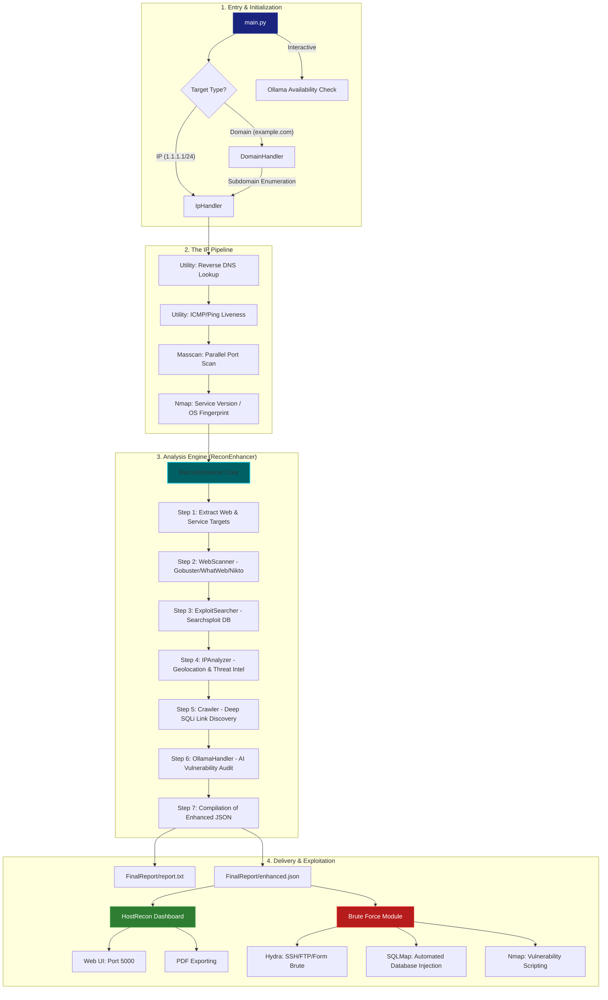

# Changelog — NullProtocol v2.0 (The Phoenix Refactor)

NullProtocol v2.0 is a complete overhaul of the original Fsociety Recon Pipeline. It transitions from a linear script into a modular, AI-powered, and attack-ready framework.

## 🚀 Key Improvements
- **AI Integration**: Local Ollama support for smart vulnerability analysis and exploit suggestions.
- **Advanced Crawling**: Dedicated SQLi-focused BFS crawler for deep parameter discovery on web targets.
- **Attack Chaining**: New Brute Force module that leverages recon data to launch Hydra/SQLMap attacks.
- **Web Dashboard**: HostRecon Flask app for professional, dark-themed result visualization.
- **Rich UI**: Completely replaced standard printing with `rich` console tables, progress bars, and banners.
- **Refined Pipeline**: Added noise filtering (404/500 removal) and multi-step enrichment (Reverse DNS, Geolocation).

---

## 🗺️ System Flowchart (In-Depth)



---

## 📂 File-by-File Breakdown

### 1. `recon/utility.py` (Core Foundation)
The utility layer provides the visual and functional primitives for the entire project.

```python
# Snippet: Rich Console Helpers and IP Enrichment Logic
def enrich_ip_info(ip):
    """Perform reverse DNS and liveness checks for an IP."""
    info = {"ip": ip, "rdns": "N/A", "status": "Unknown"}
    try:
        rdns = reverse_dns(ip)
        if rdns:
            info["rdns"] = rdns
        
        if is_host_alive(ip):
            info["status"] = "[green]Online[/green]"
        else:
            info["status"] = "[red]Offline[/red]"
    except Exception:
        pass
    return info

def make_table(title, columns, rows):
    """Create a beautiful rich table."""
    from rich.table import Table
    table = Table(title=f"\n[bold cyan]{title}[/bold cyan]", title_justify="left", border_style="bright_black")
    for col, style in columns:
        table.add_column(col, style=style)
    for row in rows:
        table.add_row(*row)
    console.print(table)

def banner():
    """Display the NullProtocol ASCII banner with attribution."""
    console.print(f"\n[bold cyan]{'='*60}[/bold cyan]")
    console.print("[bold white]   ███╗   ██╗██╗   ██╗██╗     ██╗      [/bold white]")
    console.print("[bold white]   ████╗  ██║██║   ██║██║     ██║      [/bold white]")
    console.print("[bold white]   ██╔██╗ ██║██║   ██║██║     ██║      [/bold white]")
    console.print("[bold white]   ██║╚██╗██║██║   ██║██║     ██║      [/bold white]")
    console.print("[bold white]   ██║ ╚████║╚██████╔╝███████╗███████╗ [/bold white]")
    console.print("[bold white]   ╚═╝  ╚═══╝ ╚═════╝ ╚══════╝╚══════╝ [/bold white]")
    console.print("[bold cyan]            P R O T O C O L  v 2 . 0           [/bold cyan]")
    console.print("[bold white]       Dhruvil | github.com/koffandaff       [/bold white]")
    console.print(f"[bold cyan]{'='*60}[/bold cyan]\n")
```

### 2. `recon/ReconEnhancer.py` (The Brain)
Orchestrates the 7-step analysis pipeline and manages data flow between modules.

```python
# Snippet: The Comprehensive Scan Workflow
class ReconEnhancer:
    def __init__(self, domain, subdomain_file, nmap_json, ip_input):
        self.domain = domain
        self.subdomain_file = subdomain_file
        self.nmap_json = nmap_json
        self.ip_input = ip_input
        self.results = {
            "domain": domain,
            "timestamp": datetime.now().isoformat(),
            "web_targets": [],
            "service_targets": [],
            "ip_analyses": [],
            "crawler": {},
            "ollama_analysis": None
        }
        self.run_comprehensive_scan()

    def run_comprehensive_scan(self):
        """Orchestrates the 7-step analysis pipeline."""
        steps = [
            ("Extracting targets", self.extract_all_targets),
            ("Web scanning (Gobuster/WhatWeb)", self.scan_web_targets),
            ("Service analysis (Searchsploit)", self.analyze_service_targets),
            ("IP Geolocation & Threat Intel", self.analyze_ips),
            ("Running SQLi Crawler", self.run_sqli_crawler),
            ("Ollama AI Analysis", self.run_ollama_analysis),
            ("Generating final summary", self.generate_summaries)
        ]
        
        for i, (msg, func) in enumerate(steps, 1):
            status_msg(f"Step {i}/7: {msg}...")
            try:
                func()
                success_msg(f"Completed: {msg}")
            except Exception as e:
                error_msg(f"Failed {msg}: {str(e)}")
```

### 3. `recon/ReconEnhancerTools/crawler.py` (The SQLi Hunter)
A specialized BFS crawler designed to find vulnerable parameters and forms.

```python
# Snippet: Link Extraction and SQLi Scoring
class SQLiCrawler:
    def crawl(self, start_url):
        """Crawls the website starting from start_url."""
        self.base_url = start_url
        self.to_visit.append(start_url)
        
        with get_progress_bar() as progress:
            task = progress.add_task("[cyan]Crawling...", total=self.max_pages)
            while self.to_visit and len(self.visited) < self.max_pages:
                url = self.to_visit.pop(0)
                if url in self.visited: continue
                
                self._process_page(url)
                progress.update(task, advance=1)

    def _calculate_sqli_score(self, url, type='get_param', params=None):
        """Assign a priority score to a target based on heuristic patterns."""
        score = 1
        target_str = (url + str(params)).lower()
        
        # High-interest SQL keywords in paths/params
        keywords = ['id', 'user', 'admin', 'search', 'query', 'cat', 'item', 'product', 'page', 'sort']
        for kw in keywords:
            if kw in target_str:
                score += 1
                
        # POST forms are generally more interesting for SQLi
        if type == 'form':
            score += 1
            
        return score
```

### 4. `recon/ReconEnhancerTools/ollama_handler.py` (LLM Integration)
Communicates with local Ollama via REST API to provide expert-level audit reports.

```python
# Snippet: AI Prompt Engineering & API Handling
def analyze_findings_with_ollama(findings_json, model=None):
    """Sends recon findings to Ollama for expert vulnerability analysis."""
    if not is_ollama_available():
        return "Ollama is not running. AI analysis skipped."

    model = model or "llama3"
    info_msg(f"Analyzing findings with Ollama model: {model}")

    # Optimized prompt for security findings
    prompt = f"""
    You are an expert Security Researcher. Review these reconnaissance findings:
    {json.dumps(findings_json, indent=2)}
    
    Provide a concise technical report including:
    - TOP 3 critical vulnerabilities
    - Recommended exploit path for each
    - Mitigation strategies for the developer
    """
    
    try:
        response = requests.post('http://localhost:11434/api/generate',
                                json={'model': model, 'prompt': prompt, 'stream': False},
                                timeout=180)
        return response.json().get('response', 'AI provided an empty response.')
    except Exception as e:
        return f"Ollama dynamic analysis failed: {str(e)}"
```

### 5. `recon/hostrecon.py` (The Command Center)
A Flask application that turns JSON data into a professional dark-themed reporting portal.

```python
# Snippet: Dashboard & PDF Export Logic
@app.route('/scan/<domain_dir>')
def scan_detail(domain_dir):
    """Detailed view for a single scan with stat computation."""
    data = load_scan_data(domain_dir)
    if not data: abort(404)

    # Compute severity statistics for the dashboard
    vuln_stats = {'critical': 0, 'high': 0, 'medium': 0, 'low': 0, 'info': 0}
    for wt in data.get('web_targets', []):
        for v in wt.get('vulnerabilities', []):
            sev = v.get('severity', 'low').lower()
            if sev in vuln_stats: vuln_stats[sev] += 1

    return render_template('scan_detail.html', 
                           data=data, 
                           domain_dir=domain_dir, 
                           vuln_stats=vuln_stats)

@app.route('/export/pdf/<domain_dir>')
def export_pdf(domain_dir):
    """Export scan report to PDF using wkhtmltopdf."""
    # ... logic to render 'report_print.html' and pass to wkhtmltopdf ...
    subprocess.run(['wkhtmltopdf', html_path, pdf_path])
    return send_file(pdf_path, as_attachment=True)
```

### 6. `brute/main.py` (The Aggressor)
The entry point for the Brute Force module, linking recon results to active exploitation.

```python
# Snippet: Attack Opportunity Mapping
def identify_attack_opportunities(data):
    """Analyze recon data and identify viable attack targets for Hydra/SQLMap."""
    opportunities = []

    # SSH & FTP detection from service targets
    for st in data.get('service_targets', []):
        target = st.get('target', {})
        service = target.get('service', '').lower()
        if service in ['ssh', 'ftp']:
            opportunities.append({
                'tool': 'Hydra',
                'service': service.upper(),
                'ip': target.get('ip'),
                'description': f"{service.upper()} Brute Force on {target.get('ip')}",
                'severity': 'high',
                'func': hydra_ssh if service == 'ssh' else hydra_ftp
            })

    # SQLi targets from the Crawler stage
    for url, cdata in data.get('crawler', {}).items():
        for sqli in cdata.get('potential_sqli', []):
            if sqli.get('sqli_score', 0) >= 2:
                opportunities.append({
                    'tool': 'SQLMap',
                    'url': sqli.get('url'),
                    'description': f"SQL Injection test on {sqli.get('url')}",
                    'severity': 'critical',
                    'func': sqlmap_url
                })
    return opportunities
```

### 7. `recon/main.py` (Interface)
Handles target input and provides a beautiful terminal UI using the `rich` library.

```python
# Snippet: Rich Interactive Prompts
def main():
    banner()
    try:
        # Prompt for target
        domain = Prompt.ask("  [bold white]Target Domain[/bold white]", default="")
        ips = Prompt.ask("  [bold white]Target IP/Range[/bold white]", default="")

        # Optional AI Integration
        use_ollama = interactive_ollama_check()

        if domain:
            section_header(f"RECONNAISSANCE: {domain}", "🌐")
            Create_Domain_Directory(domain)
            from Domain import DomainHandler
            DomainHandler(domain)
        elif ips:
            section_header(f"RECONNAISSANCE: {ips}", "📡")
            from IpHandler import IpHandler
            IpHandler(ips, "", "")
        else:
            error_msg("Mission aborted: No target specified.")
            
    except KeyboardInterrupt:
        console.print("\n  [bold red]⏹  Shutting down...[/bold red]")
```

### 8. `brute/attack_chain.py` (Tool Wrappers)
Wraps complex CLI tools like Hydra and SQLMap into clean Python functions.

```python
# Snippet: Hydra Multi-Protocol Handling
def hydra_ssh(opportunity, output_dir):
    """Brute force SSH using Hydra with auto-wordlist."""
    ip = opportunity.get('ip')
    user_list = find_wordlist('usernames')
    pass_list = find_wordlist('passwords')
    
    info_msg(f"Launching Hydra SSH against {ip}...")
    cmd = f'hydra -L {user_list} -P {pass_list} -s 22 -t 4 -f -vV {ip} ssh'
    
    result = run_tool(cmd, output_file=os.path.join(output_dir, f'ssh_{ip}.txt'))
    
    # Parse for successful logins
    creds = [line for line in result['output'].split('\n') if 'host:' in line and 'login:' in line]
    result['message'] = f"Found {len(creds)} success(es)"
    return result
```

---

## 🛠️ Summary of New Dependencies
- **Flask**: Web reporting server for HostRecon.
- **BeautifulSoup4**: Robust HTML parsing for the BFS crawler.
- **Ollama**: Integration for AI-powered vulnerability insights.
- **Rich**: Advanced terminal UI components (Colors, Tables, Progress Bars).
- **wkhtmltopdf**: Used by HostRecon to generate PDF reports.
- **Hydra/SQLMap/ffuf**: Back-end tools for the Brute Force module.
