# Code Flow — NullProtocol Reconnaissance Pipeline

This document details the complete end-to-end execution flow of NullProtocol, from initial input to final report generation.

## Execution Flowchart

```mermaid
graph TD
    %% START
    A[Input: Domain/IP] --> B{Input Type?}
    
    %% DOMAIN PATH
    B -->|Domain| C[Domain Handler]
    
    subgraph C [Domain Processing Pipeline]
        C1[subdomain.GetSubDomain<br/>Initialization]
        C2[dnsrecon -d domain -j output.json<br/>DNS Enumeration]
        C3[findomain -t domain -u output.txt<br/>Subdomain Discovery]
        C4[SubDomainExtraction.py<br/>Parse JSON/TXT]
        C5[IpExtraction.py<br/>Extract IPs from JSON]
        C6[Create_Domain_Directory<br/>results/domain/]
        C7[Save Subdomains to .txt]
        C8[DnsResolver.IpConvertor<br/>DNS Resolution]
        C9[Merge & Unique IPs]
    end
    
    C1 --> C2
    C1 --> C3
    C2 --> C4
    C3 --> C4
    C4 --> C5
    C5 --> C9
    C6 --> C7
    C4 --> C7
    C7 --> C8
    C8 --> C9
    
    C9 --> D[Unique IP Addresses List]
    
    %% IP DIRECT PATH
    B -->|IP Address| E[Direct IP Input]
    E --> D
    
    D --> F[IP Handler Module]
    
    subgraph F [Masscan & Nmap Pipeline]
        F1[Validate_Ip function<br/>IP Validation]
        F2[Create_Domain_Directory<br/>results/domain/Ip/]
        F3[masscan --top-ports 1000<br/>Fast Port Scan]
        F4[Save .json results]
        F5[Clean empty .json files]
        F6[Pass to IpNmapHandler]
    end
    
    F1 --> F2
    F2 --> F3
    F3 --> F4
    F4 --> F5
    F5 --> F6
    
    F6 --> G[IpNmapHandler Module]
    
    subgraph G [Advanced Nmap Scanning]
        G1[Parallel Scan Coordination]
        
        subgraph G2 [Service Discovery Phase]
            G2A[nmap -sS --top-ports 100 -T4 -v -sV<br/>Service & Version Detection]
            G2B[Save .xml results]
            G2C[NmapXMLCleaner.parse_service_scan<br/>Parse XML]
            G2D[Save .txt & .json reports]
        end
        
        subgraph G3 [OS Discovery Phase]
            G3A[nmap -sS -O<br/>OS Fingerprinting]
            G3B[Save .xml results]
            G3C[NmapXMLCleaner.parse_os_scan<br/>Parse XML]
            G3D[Save .txt & .json reports]
        end
        
        G4[Combine Results<br/>Create NmapReport.json]
    end
    
    G1 --> G2
    G1 --> G3
    G2A --> G2B
    G2B --> G2C
    G2C --> G2D
    G3A --> G3B
    G3B --> G3C
    G3C --> G3D
    G2D --> G4
    G3D --> G4
    
    %% RECON ENHANCEMENT FLOW - NEW ADDITION
    G4 --> H[ReconEnhancer Module]
    
    subgraph H [Enhanced Reconnaissance Suite]
        H1[Initialize ReconEnhancer]
        
        subgraph H2 [Web Target Analysis]
            H2A[web_scanner.py<br/>HTTP/HTTPS Check]
            H2B[WhatWeb Scan<br/>Tech Fingerprinting]
            H2C[Gobuster Directory Brute<br/>Common & Custom Wordlists]
            H2D[Quick Vuln Checks<br/>.env, backup, git exposure]
            H2E[API Discovery<br/>Common Endpoints]
            H2F[Aggregate Web Results]
        end
        
        subgraph H3 [Exploit Intelligence]
            H3A[exploit_searcher.py<br/>Parse Service Versions]
            H3B[Searchsploit Integration<br/>Local Exploit-DB Query]
            H3C[CVE Prioritization<br/>Risk Scoring]
            H3D[Exploit Availability Check]
            H3E[Generate Exploit Recommendations]
        end
        
        subgraph H4 [Threat Intelligence]
            H4A[ip_analyzer.py<br/>IP Geolocation]
            H4B[ASN & ISP Information]
            H4C[Threat Feed Lookup<br/>Malicious IP Check]
            H4D[Reverse DNS Lookup]
            H4E[Aggregate Intel Data]
        end
        
        H5[Generate Final Report<br/>Markdown + JSON]
        H6[Create Executive Summary]
    end
    
    H1 --> H2
    H1 --> H3
    H1 --> H4
    H2A --> H2B
    H2B --> H2C
    H2C --> H2D
    H2D --> H2E
    H2E --> H2F
    
    H2F --> H5
    H3E --> H5
    H4E --> H5
    H5 --> H6
    
    %% DATA FLOW CONNECTIONS
    G4 -.->|Service Data| H3A
    G4 -.->|IP Addresses| H4A
    H2F -.->|Web URLs| H3A
    
    %% DIRECTORY STRUCTURE ENHANCEMENT
    I[Enhanced Directory Structure] --> J[results/domain/<br/>Subdomain lists, IP lists]
    I --> K[results/domain/Ip/<br/>Masscan JSON files]
    I --> L[results/domain/Nmap/Service_Discovery/<br/>Service scan TXT/JSON]
    I --> M[results/domain/Nmap/OS_Discovery/<br/>OS scan TXT/JSON]
    I --> N[results/domain/Nmap/<br/>Combined NmapReport.json]
    I --> O[results/domain/ReconEnhancer/<br/>Web_Scans, Exploit_Findings, Threat_Intel, Reports]
    
    %% FINAL OUTPUTS
    H5 --> P[Comprehensive Recon Report]
    H6 --> Q[Executive Summary]
    
    P --> R[Subdomain enumeration]
    P --> S[IP address mapping]
    P --> T[Open port detection]
    P --> U[Service & version info]
    P --> V[OS fingerprinting]
    P --> W[Web tech stack]
    P --> X[Directory/API discovery]
    P --> Y[Exploit recommendations]
    P --> Z[Threat intelligence]
    
    Q --> AA[Risk Score Summary]
    Q --> AB[Critical Findings]
    Q --> AC[Immediate Actions]
    Q --> AD[Remediation Timeline]
    
    %% UTILITY MODULES
    AE[Utility Modules] --> AF[FileType detection]
    AE --> AG[FileGenarator<br/>Timestamp naming]
    AE --> AH[Create_Domain_Directory<br/>Folder structure]
    AE --> AI[Validate_Ip<br/>IP validation]
    AE --> AJ[Result Aggregator<br/>Combine JSON/TXT]
    AE --> AK[Thread Manager<br/>Concurrent processing]
    AE --> AL[Report Generator<br/>Markdown/JSON]
    
    %% CONNECTIONS TO UTILITY MODULES
    AF -.-> C4
    AF -.-> C5
    AF -.-> G2C
    AF -.-> G3C
    AG -.-> C2
    AG -.-> C3
    AG -.-> F3
    AG -.-> G2A
    AG -.-> G3A
    AH -.-> C
    AH -.-> F
    AH -.-> O
    AI -.-> F
    AJ -.-> C9
    AJ -.-> G4
    AJ -.-> H5
    AK -.-> C8
    AK -.-> G1
    AK -.-> H2C
    AL -.-> H5
    AL -.-> H6
    
    %% STYLING
    style A fill:#4CAF50,color:white
    style B fill:#ff6b6b,color:white
    style C fill:#e3f2fd,stroke:#1976d2
    style F fill:#e8f5e8,stroke:#43a047
    style G fill:#fff3e0,stroke:#ff9800
    style H fill:#fce4ec,stroke:#e91e63,stroke-width:2px
    style G2 fill:#f3e5f5,stroke:#9c27b0
    style G3 fill:#e8f5e8,stroke:#4caf50
    style H2 fill:#e1f5fe,stroke:#03a9f4
    style H3 fill:#f1f8e9,stroke:#8bc34a
    style H4 fill:#fff3e0,stroke:#ff9800
    style I fill:#eceff1,stroke:#607d8b
    style P fill:#009688,color:white
    style Q fill:#673ab7,color:white
    style AE fill:#bbdefb,stroke:#2196f3
    
    %% COMMAND EXECUTION NODES
    style C2,C3,F3,G2A,G3A fill:#ff9800
    style H2B,H2C,H3B fill:#ff9800
    
    %% PARSING & PROCESSING NODES
    style C4,C5,C8,F1,F5,G2C,G3C fill:#2196f3,color:white
    style H2F,H3A,H3C,H4A,H5 fill:#2196f3,color:white
    
    %% FILE & DIRECTORY OPERATIONS
    style C6,C7,C9,F2,F4,G1,G2B,G3B,G4 fill:#4caf50,color:white
    style H1,H6 fill:#4caf50,color:white
    
    %% ENHANCED MODULE SPECIFIC STYLES
    style H2A,H2D,H2E fill:#00bcd4,color:white
    style H3D,H3E fill:#8bc34a,color:white
    style H4B,H4C,H4D,H4E fill:#ff9800
    
    %% FINAL REPORTS
    style P,Q fill:#9c27b0,color:white
    
    %% LEGEND BOX
    subgraph Legend [Color Legend]
        L1[Command Execution] 
        L2[Data Processing] 
        L3[File Operations]
        L4[Final Output]
        L5[Critical Modules]
    end
```

## Detailed Breakdown

### 1. Input Layer
The process begins with the user providing either a **Domain** or a list of **IP Addresses**. The entry point (`main.py`) determines the input type and routes the execution to the appropriate handler.

### 2. Domain Processing Pipeline
If a domain is provided:
- **Subdomain Discovery:** Uses `dnsrecon` and `findomain` to identify subdomains.
- **Extraction & Resolution:** `SubDomainExtraction.py` and `IpExtraction.py` process the tool outputs. `DnsResolver` converts subdomains to IP addresses.
- **Aggregation:** All discovered IPs are merged and deduplicated to create a unique list of target IPs.

### 3. IP Handler & Masscan Pipeline
For both direct IP inputs and resolved domain IPs:
- **Fast Scanning:** `masscan` performs a high-speed scan of the top 1000 ports to identify active hosts and open ports.
- **Cleanup:** Empty results are discarded, and the active targets are passed to the next stage.

### 4. Advanced Nmap Scanning
Active hosts undergo deep inspection via Nmap:
- **Service Discovery:** Detection of service versions and protocols (`-sV`).
- **OS Discovery:** Fingerprinting the target operating system (`-O`).
- **Processing:** Results are cleaned, parsed from XML to JSON, and combined into a master `NmapReport.json`.

### 5. ReconEnhancer Suite
This is the "brain" of the reconnaissance, adding intelligence to the raw port data:
- **Web Target Analysis:** Identifies HTTP/HTTPS services, fingerprints tech stacks (`WhatWeb`), bruteforces directories (`Gobuster`), and checks for common vulnerabilities (`.env` leaks, backup files).
- **Exploit Intelligence:** Matches discovered service versions against local exploit databases (`Searchsploit`) and calculates risk scores based on CVEs.
- **Threat Intelligence:** Performs geolocation, ASN lookups, and checks IPs against known threat feeds.

### 6. Directory Structure & Outputs
The system organizes all data into a structured `results/` hierarchy:
- **Logs & Lists:** Subdomains, IPs, and raw tool outputs.
- **Reports:** A comprehensive Markdown report for technical deep-dives and an Executive Summary for high-level risk assessment.

### 7. Utility Modules
Supporting the entire pipeline are core utilities:
- **Threading:** Managing concurrent tool execution for maximum speed.
- **Validation:** Ensuring IP formats and file types are correct.
- **Aggregation:** Combining disparate data sources into unified JSON reports.
