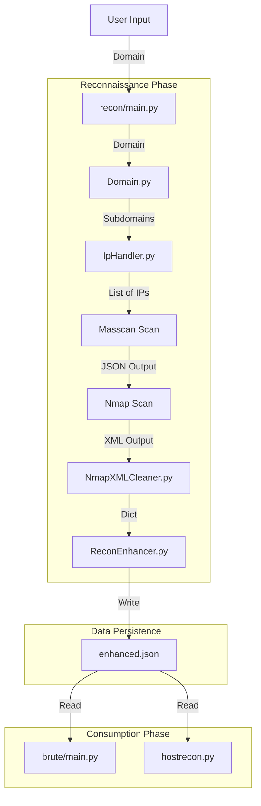
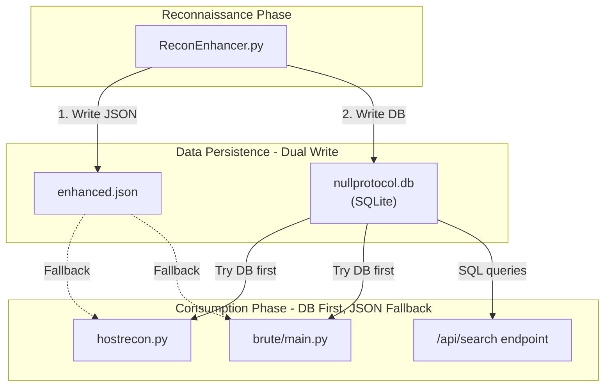

# Architecture & Data Flow

This document visualizes how files in NullProtocol interact and how data is transformed as it moves through the pipeline.

## High-Level Data Flow



## Data File Formats

### 1. `enhanced.json`
This is the central source of truth for a scan. It aggregates all data.

```json
{
  "domain": "example.com",
  "timestamp": "2024-02-16 10:00:00",
  "hosts": [
    {
      "ip": "192.168.1.5",
      "os": "Linux 5.4",
      "ports": [
        {
          "port": 80,
          "service": "http",
          "version": "Apache 2.4.49",
          "product": "Apache httpd"
        },
        {
          "port": 22,
          "service": "ssh",
          "version": "OpenSSH 8.2"
        }
      ]
    }
  ],
  "web_analysis": {
    "technologies": ["WordPress", "PHP"],
    "vulnerabilities": ["CVE-2021-41773"]
  },
  "service_targets": [
    {
      "service": "ssh",
      "target": {"ip": "192.168.1.5", "port": 22}
    }
  ]
}
```

## detailed File Interactions

1.  **`subdomain.py` -> `DnsResolver.py`**
    - `subdomain.py` generates a text file list of subdomains.
    - `DnsResolver.py` reads that text file, resolves IPs, and returns a Python List `['1.1.1.1', ...]` to `Domain.py`.

2.  **`IpHandler.py` -> `NmapXMLCleaner.py`**
    - `IpHandler` runs Nmap which outputs an `.xml` file.
    - `NmapXMLCleaner` reads strict XML and returns a clean Python Dictionary structure `{'ip': '...', 'ports': [...]}`.

3.  **`ReconEnhancer.py` -> `brute/main.py`**
    - The Enhancer calculates "Service Targets" (e.g., "This IP has SSH open").
    - It saves this in `enhanced.json`.
    - `brute/main.py` reads `enhanced.json` and looks specifically for the `service_targets` key to populate the attack menu.

---

## Database-Enhanced Data Flow

With the SQLite integration, the pipeline now uses **dual-write** and **fallback reads**:



### Key Behaviors

| Component | Write | Read |
|---|---|---|
| `ReconEnhancer.py` | JSON ✅ + SQLite ✅ | — |
| `hostrecon.py` | — | SQLite first → JSON fallback |
| `brute/main.py` | — | SQLite first → JSON fallback |
| `/api/search` | — | SQLite only (501 if unavailable) |

### Backward Compatibility

- **Old scans** (pre-DB): Only have `enhanced.json` → consumers fall back to JSON automatically
- **New scans**: Have both files → consumers read from SQLite for faster queries
- **DB deleted**: JSON copy still exists → system continues working
