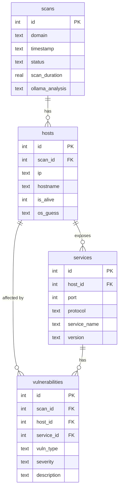
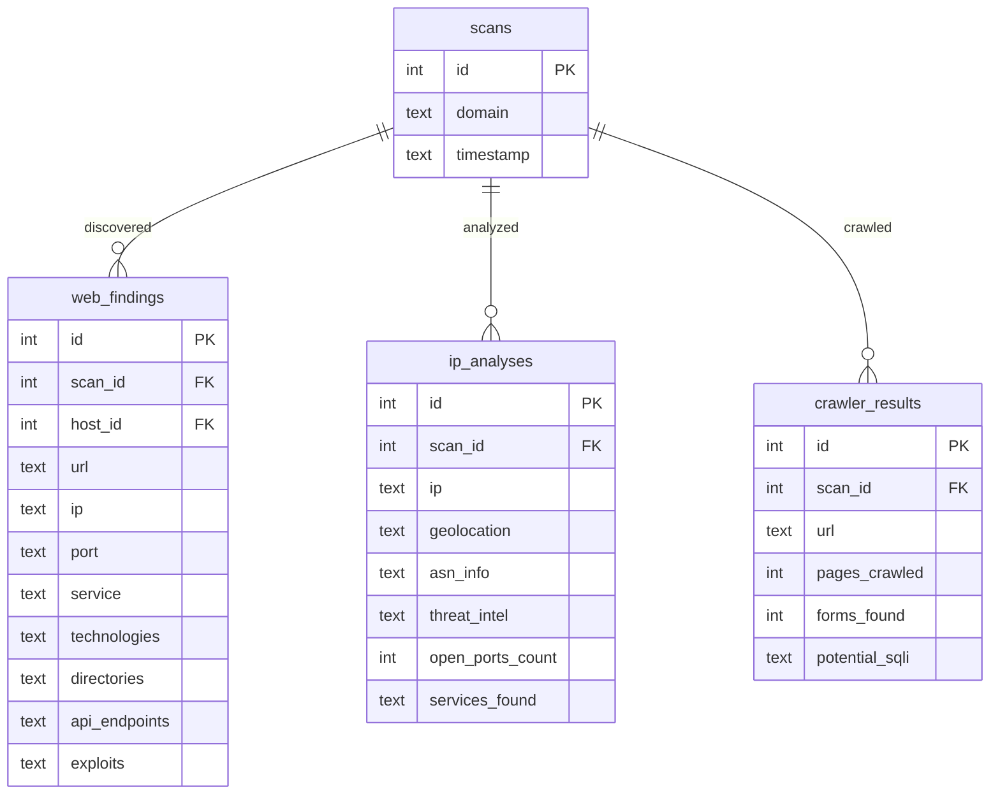

# Database Schema — NullProtocol SQLite Layer

NullProtocol stores scan results in a normalized SQLite database (`nullprotocol.db`) alongside the existing `enhanced.json` for backward compatibility.

## Design Decisions

| Decision | Rationale |
|---|---|
| **SQLite** (not PostgreSQL) | Zero-config, file-based, perfect for single-user recon tool |
| **WAL journal mode** | Allows concurrent reads during writes |
| **7 normalized tables** | Eliminates data redundancy, enables SQL queries |
| **Dual-write** (JSON + DB) | Backward compatible — older tools still read JSON |
| **No new dependencies** | `sqlite3` is Python stdlib |

## Database Location

```
results/<domain>/FinalReport/nullprotocol.db
results/<domain>/FinalReport/enhanced.json   (kept for backward compat)
```

## ER Diagram

> **7 tables** across two diagrams for readability.

### Core Relationships — scans → hosts → services → vulnerabilities



### Scan-Level Entities — web_findings, ip_analyses, crawler_results




## Table Details

### `scans` — Root table for each reconnaissance run
| Column | Type | Description |
|---|---|---|
| `id` | INTEGER PK | Auto-incrementing scan identifier |
| `domain` | TEXT NOT NULL | Target domain (e.g. `example.com`) |
| `timestamp` | TEXT NOT NULL | ISO 8601 scan start time |
| `status` | TEXT | `complete` by default |
| `subdomains_count` | INTEGER | Number of discovered subdomains |
| `ips_count` | INTEGER | Number of discovered IPs |
| `web_targets_count` | INTEGER | Number of web targets scanned |
| `service_targets_count` | INTEGER | Number of service targets scanned |
| `scan_duration` | REAL | Total scan time in seconds |
| `ollama_analysis` | TEXT | AI analysis text (if Ollama was used) |
| `created_at` | TEXT | Row creation timestamp (auto-filled) |

### `hosts` — Discovered IP addresses/hosts
| Column | Type | Description |
|---|---|---|
| `id` | INTEGER PK | Host identifier |
| `scan_id` | INTEGER FK→scans | Parent scan |
| `ip` | TEXT NOT NULL | IP address |
| `hostname` | TEXT | Reverse DNS / hostname |
| `is_alive` | INTEGER | 1 = alive, 0 = down |
| `os_guess` | TEXT | OS fingerprint guess |

### `services` — Open ports and services on hosts
| Column | Type | Description |
|---|---|---|
| `id` | INTEGER PK | Service identifier |
| `host_id` | INTEGER FK→hosts | Parent host |
| `port` | INTEGER | Port number |
| `protocol` | TEXT | `tcp` or `udp` |
| `service_name` | TEXT | Service name (ssh, http, etc.) |
| `version` | TEXT | Version string (e.g. `OpenSSH 8.2`) |
| `banner` | TEXT | Service banner text |
| `raw_service` | TEXT | Raw Nmap service string |

### `vulnerabilities` — Security findings from all sources
| Column | Type | Description |
|---|---|---|
| `id` | INTEGER PK | Vulnerability identifier |
| `service_id` | INTEGER FK→services | Linked service (nullable) |
| `host_id` | INTEGER FK→hosts | Linked host (nullable) |
| `scan_id` | INTEGER FK→scans | Parent scan |
| `source_type` | TEXT | `web` or `service` |
| `vuln_type` | TEXT | Vulnerability type (xss, sqli, etc.) |
| `severity` | TEXT | `critical`, `high`, `medium`, `low`, `info` |
| `title` | TEXT | Brief title |
| `description` | TEXT | Detailed description |
| `cve_id` | TEXT | CVE identifier if applicable |

### `web_findings` — Web-specific scan results
JSON columns store complex nested data (technologies, directories, endpoints, exploits) serialized as JSON strings.

| Column | Type | Description |
|---|---|---|
| `id` | INTEGER PK | Finding identifier |
| `scan_id` | INTEGER FK→scans | Parent scan |
| `host_id` | INTEGER FK→hosts | Linked host |
| `url` | TEXT | Target URL |
| `ip` | TEXT | Target IP |
| `port` | TEXT | Port (stored as text for flexibility) |
| `service` | TEXT | Service name |
| `technologies` | TEXT (JSON) | Detected technologies dict |
| `directories` | TEXT (JSON) | Discovered directories list |
| `api_endpoints` | TEXT (JSON) | Found API endpoints list |
| `exploits` | TEXT (JSON) | Applicable exploits list |

### `ip_analyses` — IP-level intelligence
| Column | Type | Description |
|---|---|---|
| `id` | INTEGER PK | Analysis identifier |
| `scan_id` | INTEGER FK→scans | Parent scan |
| `ip` | TEXT | Analyzed IP address |
| `geolocation` | TEXT (JSON) | City, country, region |
| `asn_info` | TEXT (JSON) | ASN organization info |
| `threat_intel` | TEXT (JSON) | Threat intelligence indicators |
| `port_analysis` | TEXT (JSON) | Per-port analysis results |
| `open_ports_count` | INTEGER | Total open ports |
| `services_found` | TEXT (JSON) | List of service names |

### `crawler_results` — SQLi crawler output
| Column | Type | Description |
|---|---|---|
| `id` | INTEGER PK | Result identifier |
| `scan_id` | INTEGER FK→scans | Parent scan |
| `url` | TEXT | Crawled base URL |
| `pages_crawled` | INTEGER | Total pages visited |
| `forms_found` | INTEGER | Forms discovered |
| `potential_sqli` | TEXT (JSON) | Potential SQL injection targets |

## Indexes

| Index | Table | Column(s) | Purpose |
|---|---|---|---|
| `idx_scans_domain` | scans | domain | Fast domain lookup |
| `idx_scans_timestamp` | scans | timestamp | Chronological queries |
| `idx_hosts_scan_id` | hosts | scan_id | Join to scan |
| `idx_hosts_ip` | hosts | ip | IP-based lookups |
| `idx_services_host` | services | host_id | Join to host |
| `idx_vulns_scan` | vulnerabilities | scan_id | All vulns for a scan |
| `idx_vulns_severity` | vulnerabilities | severity | Filter by severity |
| `idx_web_scan` | web_findings | scan_id | All web findings for a scan |
| `idx_ip_scan` | ip_analyses | scan_id | All IP analyses for a scan |
| `idx_crawler_scan` | crawler_results | scan_id | All crawler results for a scan |

## JSON Serialization

Columns marked `TEXT (JSON)` store serialized JSON strings. The `DatabaseHandler` uses helper methods:

- **`_json_dump(obj)`** — Safely serializes Python dicts/lists to JSON strings
- **`_json_load(text)`** — Safely deserializes JSON strings back to Python objects, returns the raw string if parsing fails
