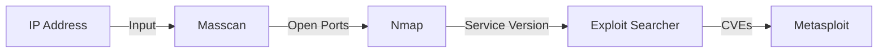
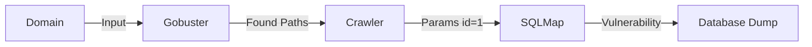

# Tools Reference

This document details the security tools integrated into NullProtocol, their purpose, usage within our code, and how they connect.

## Integrated Tools

| Tool | Category | Usage in NullProtocol |
| :--- | :--- | :--- |
| **Nmap** | Recon / Scanning | Used for Service Version Detection (`-sV`) and OS detection (`-O`) on ports found by Masscan. |
| **Masscan** | Recon / Scanning | High-speed port scanner used as the first filter to identify open ports quickly (`--rate=25000`). |
| **DnsRecon** | Recon / DNS | Enumerates subdomains and DNS records. |
| **Findomain** | Recon / DNS | High-performance subdomain enumeration (Rust-based). |
| **Gobuster** | Web / Enum | Directory and file brute-forcing (`dir` mode) and VHost discovery (`vhost` mode). |
| **WhatWeb** | Web / Enum | Identifies technologies, CMS, and Content-Security-Policies. |
| **Hydra** | Attack / Brute | Parallelized login cracker for SSH, FTP, MySQL, RDP, etc. |
| **SQLMap** | Attack / SQLi | Automated detection and exploitation of SQL injection flaws. |
| **Hping3** | Attack / DoS | Packet generator used for stability/stress testing (SYN Flood). |
| **SearchSploit** | Analysis | CLI tool for Exploit-DB, used to map services to CVEs. |
| **Metasploit** | Attack / Exploit | Framework for executing exploit code; we generate `.rc` resource scripts for it. |
| **Ollama** | AI / Analysis | Local LLM used to analyze raw scan data and generate natural language insights. |

## Tool Chains & Connections

### 1. The Port Scan Chain

- **Masscan** is fast but dumb. It finds *where* the doors are.
- **Nmap** is slower but smart. It looks *inside* the doors found by Masscan.
- **Exploit Searcher** takes Nmap's answer ("Apache 2.4.49") and asks Exploit-DB for vulnerabilities.

### 2. The Web Chain

- **Gobuster** finds hidden folders (`/admin`).
- **Crawler** visits those folders and finds forms/links.
- **SQLMap** attacks the parameters found by the crawler.

## Parameter Reference

### Masscan
- **Command**: `masscan --top-ports 1000 {ip} --open --rate=25000 --wait 0 -oJ {File}.json`
- **Key Params**:
    - `--rate=25000`: Sends 25k packets per second.
    - `--wait 0`: Don't wait long for responses (aggressive).
    - `-oJ`: Output in JSON format.

### Nmap
- **Command**: `nmap -sV -O -p{ports} -T4 --open -Pn {ip}`
- **Key Params**:
    - `-sV`: Service Version Detection.
    - `-O`: OS Detection.
    - `-T4`: Aggressive timing template.
    - `-Pn`: Treat host as online (skip ping).

### Hydra
- **Command**: `hydra -L {user_list} -P {pass_list} {ip} {service} -t 16`
- **Key Params**:
    - `-L/-P`: Lists for usernames/passwords.
    - `-t 16`: 16 Parallel threads.

### SQLMap
- **Command**: `sqlmap -u "{url}" --batch --random-agent --level=1 --risk=1`
- **Key Params**:
    - `--batch`: Non-interactive mode (auto-accept defaults).
    - `--random-agent`: Use random User-Agent header to evade basics WAFs.
